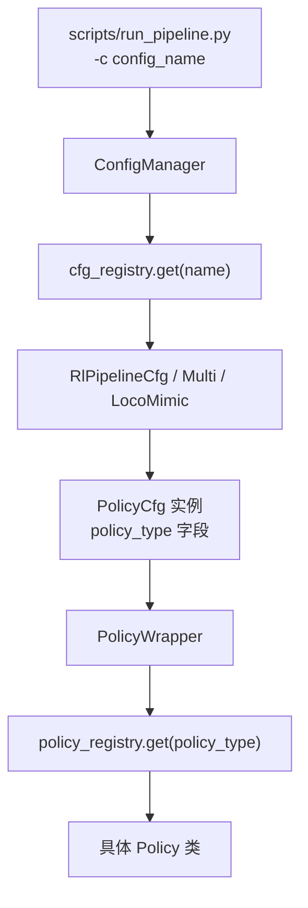

# 添加新策略（Policy）指南

本文档详细说明如何在 RoboJuDo 中添加一个新的 Policy。整个过程涉及 5 个关键步骤、6\~7 个文件。

## 架构概览

RoboJuDo 采用 **注册表模式（Registry Pattern）** 管理策略。从运行命令到策略执行的完整调用链如下：



**核心概念**：

| 概念 | 说明 |
|------|------|
| `policy_registry` | 策略类注册表，通过 `policy_type` 字符串查找对应的 Policy 类 |
| `cfg_registry` | 配置类注册表，通过 `-c` 命令行参数查找对应的 Pipeline 配置 |
| `PolicyCfg` | 策略配置基类（Pydantic），定义观测、动作空间等参数 |
| `Policy` | 策略实现基类（ABC），定义推理逻辑 |

## 步骤总览

| 步骤 | 操作 | 文件 |
|------|------|------|
| 1 | 实现 Policy 类 | `robojudo/policy/my_policy.py`（新建） |
| 2 | 定义 PolicyCfg 子类 | `robojudo/policy/policy_cfgs.py`（修改） |
| 3 | 定义机器人级别配置 | `robojudo/config/g1/policy/g1_my_policy_cfg.py`（新建） |
| 4 | 注册到 policy_registry | `robojudo/policy/__init__.py`（修改） |
| 5 | 创建 Pipeline 配置 | `robojudo/config/g1/g1_cfg.py`（修改） |
| 6 | 放置模型权重 | `assets/models/g1/my_policy/`（新建） |

---

## 第一步：实现 Policy 类

新建 `robojudo/policy/my_policy.py`，继承 `Policy` 基类并使用 `@policy_registry.register` 装饰器注册。

### Policy 基类接口

`Policy` 基类定义在 `robojudo/policy/base_policy.py`，其核心接口如下：

```python
class Policy(ABC):
    def __init__(self, cfg_policy: PolicyCfg, device: str = "cpu"):
        # 自动从 cfg_policy 中读取 freq, obs_dof, action_dof 等
        # 若 disable_autoload=False，自动加载 torch.jit 模型
        ...

    @abstractmethod
    def reset(self): ...

    @abstractmethod
    def post_step_callback(self, commands: list[str] | None = None): ...

    @abstractmethod
    def get_observation(self, env_data, ctrl_data) -> tuple[np.ndarray, dict]: ...

    def get_action(self, obs: np.ndarray) -> np.ndarray: ...        # 可选重写
    def get_init_dof_pos(self) -> np.ndarray: ...                    # 可选重写
    def debug_viz(self, visualizer, env_data, ctrl_data, extras): ...  # 可选重写
```

### 三个必须实现的抽象方法

| 方法 | 用途 |
|------|------|
| `reset()` | 重置策略内部状态（如时间步、历史缓冲区等） |
| `post_step_callback(commands)` | 每步推理后的回调（更新时间步、处理外部指令等） |
| `get_observation(env_data, ctrl_data)` | 从环境数据和控制数据中构造观测向量，返回 `(obs, extras)` |

### 代码模板

```python
import numpy as np

from robojudo.policy import Policy, policy_registry
from robojudo.policy.policy_cfgs import MyPolicyCfg


@policy_registry.register
class MyPolicy(Policy):

    cfg_policy: MyPolicyCfg  # 类型标注，方便 IDE 提示

    def __init__(self, cfg_policy: MyPolicyCfg, device):
        super().__init__(cfg_policy=cfg_policy, device=device)
        # 自定义初始化逻辑
        self.reset()

    def reset(self):
        self.timestep = 0
        self.last_action = np.zeros(self.num_actions)
        # 如果使用历史缓冲区:
        # self._init_history(np.zeros(self.history_obs_size))

    def post_step_callback(self, commands: list[str] | None = None):
        self.timestep += 1

    def get_observation(self, env_data, ctrl_data) -> tuple[np.ndarray, dict]:
        obs = np.concatenate([
            env_data.base_ang_vel,
            (env_data.dof_pos - self.default_dof_pos),
            env_data.dof_vel,
        ])
        extras = {}
        return obs, extras

    # 如果默认的 torch.jit 推理不满足需求，可重写 get_action：
    # def get_action(self, obs: np.ndarray) -> np.ndarray:
    #     ...
```

**要点**：
- `@policy_registry.register` 装饰器会将类名（`MyPolicy`）注册到全局策略注册表
- `super().__init__()` 会自动加载模型文件（除非 `disable_autoload=True`）
- `env_data` 包含机器人状态（关节位置 `dof_pos`、关节速度 `dof_vel`、基座姿态等）
- `ctrl_data` 包含控制器数据（摇杆指令等）

### 如果需要自定义模型加载

某些策略可能使用 ONNX 而非 PyTorch JIT。此时需设置 `disable_autoload=True` 并在 `__init__` 中自行加载模型。参考 `StandPolicy`（`robojudo/policy/stand_policy.py`）的实现：

```python
@policy_registry.register
class MyOnnxPolicy(Policy):
    def __init__(self, cfg_policy, device):
        # 先加载模型，再调用 super().__init__（因为它会检查模型）
        self.session = ort.InferenceSession(cfg_policy.policy_file)
        super().__init__(cfg_policy=cfg_policy, device=device)
        ...
```

---

## 第二步：定义 PolicyCfg 子类

修改 `robojudo/policy/policy_cfgs.py`，新增一个 `MyPolicyCfg` 子类。

### PolicyCfg 基类字段

| 字段 | 类型 | 默认值 | 说明 |
|------|------|--------|------|
| `policy_type` | `str` | 必填 | 策略类名，必须与 Policy 类名一致 |
| `robot` | `str` | 必填 | 机器人名称，如 `"g1"` |
| `policy_file` | `@property` | — | 模型文件路径，子类应重写 |
| `disable_autoload` | `bool` | `False` | 是否禁用自动加载模型 |
| `freq` | `int` | `50` | 控制频率 (Hz) |
| `obs_dof` | `DoFConfig` | 必填 | 观测空间 DoF 配置 |
| `action_dof` | `DoFConfig` | 必填 | 动作空间 DoF 配置 |
| `action_scale` | `float` | `1.0` | 动作缩放因子 |
| `action_clip` | `float \| None` | `None` | 动作裁剪范围 |
| `action_beta` | `float` | `1.0` | 动作平滑因子（指数加权） |
| `history_length` | `int` | `0` | 历史观测帧数 |
| `history_obs_size` | `@property` | `0` | 历史观测维度，子类可重写 |

### 代码模板

在 `robojudo/policy/policy_cfgs.py` 末尾添加：

```python
class MyPolicyCfg(PolicyCfg):
    policy_type: str = "MyPolicy"

    @property
    def policy_file(self) -> str:
        policy_file = ASSETS_DIR / f"models/{self.robot}/my_policy/policy.pt"
        return policy_file.as_posix()

    freq: int = 50
    action_scale: float = 0.25
    action_clip: float | None = None
    action_beta: float = 0.8

    # ===== 策略特有配置 =====
    # 在此添加自定义字段（如 obs_scales、commands_map 等）
```

**要点**：
- `policy_type` 的值必须与第一步中 Policy 类名完全一致
- `policy_file` 属性决定了模型权重的加载路径
- `obs_dof` 和 `action_dof` 在此不设置默认值，留给机器人级别配置（第三步）

---

## 第三步：定义机器人级别配置

新建 `robojudo/config/g1/policy/g1_my_policy_cfg.py`，将通用配置落地到具体机器人。

这一步的核心是定义 `DoFConfig`（关节配置），包括关节名称、默认位姿、PD 增益等。

### 代码模板

```python
from robojudo.policy.policy_cfgs import MyPolicyCfg
from robojudo.tools.tool_cfgs import DoFConfig


class G1MyPolicyDoF(DoFConfig):
    """G1 机器人全身 DoF 配置"""
    joint_names: list[str] = [
        # 左腿
        "left_hip_pitch_joint",
        "left_hip_roll_joint",
        "left_hip_yaw_joint",
        "left_knee_joint",
        "left_ankle_pitch_joint",
        "left_ankle_roll_joint",
        # 右腿
        "right_hip_pitch_joint",
        "right_hip_roll_joint",
        "right_hip_yaw_joint",
        "right_knee_joint",
        "right_ankle_pitch_joint",
        "right_ankle_roll_joint",
        # 腰部
        "waist_yaw_joint",
        "waist_roll_joint",
        "waist_pitch_joint",
        # 根据策略需要添加更多关节...
    ]

    default_pos: list[float] | None = [
        # 与 joint_names 一一对应的默认关节角度 (rad)
        *[-0.1, 0.0, 0.0, 0.3, -0.2, 0.0],   # 左腿
        *[-0.1, 0.0, 0.0, 0.3, -0.2, 0.0],   # 右腿
        *[0.0, 0.0, 0.0],                      # 腰部
    ]

    stiffness: list[float] | None = [
        # PD 控制器的 Kp 值
        *[150, 150, 150, 300, 80, 20],
        *[150, 150, 150, 300, 80, 20],
        *[400, 400, 400],
    ]

    damping: list[float] | None = [
        # PD 控制器的 Kd 值
        *[2, 2, 2, 4, 2, 1],
        *[2, 2, 2, 4, 2, 1],
        *[15, 15, 15],
    ]

    torque_limits: list[float] | None = [
        # 关节力矩限制 (N·m)
        *[88, 139, 88, 139, 50, 50],
        *[88, 139, 88, 139, 50, 50],
        *[88, 50, 50],
    ]


class G1MyPolicyActionDoF(G1MyPolicyDoF):
    """如果动作空间只控制部分关节，使用 subset 机制"""
    _subset = True
    _subset_joint_names: list[str] | None = [
        # 只列出策略实际输出控制的关节
        "left_hip_pitch_joint",
        "left_hip_roll_joint",
        # ...
    ]


class G1MyPolicyCfg(MyPolicyCfg):
    robot: str = "g1"
    obs_dof: DoFConfig = G1MyPolicyDoF()
    action_dof: DoFConfig = G1MyPolicyActionDoF()  # 或 G1MyPolicyDoF()
```

**要点**：
- `DoFConfig` 中的列表（`joint_names`, `default_pos`, `stiffness`, `damping`, `torque_limits`）长度必须一致
- 如果动作空间与观测空间关节数不同，使用 `_subset = True` + `_subset_joint_names` 选取子集
- 关节名称必须与 MuJoCo 模型中的名称完全匹配
- 列表内关节的顺序会影响观测和动作的拼接顺序

---

## 第四步：注册到 policy_registry

修改 `robojudo/policy/__init__.py`，在文件末尾的注册区域添加一行：

```python
# ===== Declare all your custom environments here =====
policy_registry.add("UnitreePolicy", ".unitree_policy")
# ... 已有的注册 ...
policy_registry.add("MyPolicy", ".my_policy")           # <-- 新增
```

**参数说明**：

| 参数 | 值 | 说明 |
|------|----|------|
| 第一个参数 | `"MyPolicy"` | 策略类名，与 `PolicyCfg.policy_type` 一致 |
| 第二个参数 | `".my_policy"` | 相对于 `robojudo.policy` 的模块路径（即文件名去掉 `.py`） |

这里使用的是**懒加载**机制：只有在 `policy_registry.get("MyPolicy")` 被调用时，才会 import `robojudo.policy.my_policy` 模块（触发 `@policy_registry.register` 装饰器完成实际注册）。

---

## 第五步：创建 Pipeline 配置

修改 `robojudo/config/g1/g1_cfg.py`，添加一个新的 Pipeline 配置类。

### 5.1 添加 import

在文件顶部的 import 区域添加：

```python
from .policy.g1_my_policy_cfg import G1MyPolicyCfg  # noqa: F401
```

### 5.2 添加 Pipeline 配置类

在文件中新增一个使用 `@cfg_registry.register` 装饰器的配置类：

```python
@cfg_registry.register
class g1_my_policy(RlPipelineCfg):
    """G1 + MyPolicy 仿真配置"""

    robot: str = "g1"
    env: G1MujocoEnvCfg = G1MujocoEnvCfg()

    ctrl: list[JoystickCtrlCfg | KeyboardCtrlCfg] = [
        JoystickCtrlCfg(),
    ]

    policy: G1MyPolicyCfg = G1MyPolicyCfg()
```

**Pipeline 类型选择**：

| 基类 | 用途 | policy 字段 |
|------|------|-------------|
| `RlPipelineCfg` | 单策略 | `policy: PolicyCfg` |
| `RlMultiPolicyPipelineCfg` | 多策略切换 | `policies: list[PolicyCfg]` |
| `RlLocoMimicPipelineCfg` | 运动+模仿 | `loco_policy` + `mimic_policies` |

---

## 第六步：放置模型权重

将训练好的模型文件放入对应路径。默认路径由 `PolicyCfg.policy_file` 属性决定。

```
assets/models/g1/my_policy/policy.pt
```

如果使用 ONNX 格式，确保路径和扩展名与 `policy_file` 属性返回值一致。

---

## 运行验证

```bash
python scripts/run_pipeline.py -c g1_my_policy
```

`-c` 参数的值对应第五步中 `@cfg_registry.register` 装饰的类名。

---

## 完整最小示例

以下是一个最小可运行的策略实现，包含所有必要文件：

### 文件 1：`robojudo/policy/simple_walk_policy.py`

```python
import numpy as np

from robojudo.policy import Policy, policy_registry
from robojudo.policy.policy_cfgs import SimpleWalkPolicyCfg
from robojudo.utils.util_func import quat_rotate_inverse_np


@policy_registry.register
class SimpleWalkPolicy(Policy):

    cfg_policy: SimpleWalkPolicyCfg

    def __init__(self, cfg_policy: SimpleWalkPolicyCfg, device):
        super().__init__(cfg_policy=cfg_policy, device=device)
        self.obs_scale_dof_pos = 1.0
        self.obs_scale_dof_vel = 0.05
        self.obs_scale_ang_vel = 0.25
        self.reset()

    def reset(self):
        self.timestep = 0
        self.last_action = np.zeros(self.num_actions)
        self._init_history(np.zeros(self.history_obs_size))

    def post_step_callback(self, commands=None):
        self.timestep += 1

    def get_observation(self, env_data, ctrl_data):
        projected_gravity = quat_rotate_inverse_np(
            env_data.base_quat, np.array([0, 0, -1])
        )
        obs_parts = [
            env_data.base_ang_vel * self.obs_scale_ang_vel,
            (env_data.dof_pos - self.default_dof_pos) * self.obs_scale_dof_pos,
            env_data.dof_vel * self.obs_scale_dof_vel,
            projected_gravity,
            self.last_action,
        ]
        obs_current = np.concatenate(obs_parts)

        self.history_buf.append(obs_current)
        obs = np.concatenate([obs_current, *self.history_buf])

        return obs, {}

    @property
    def history_obs_size(self):
        return self.num_dofs * 2 + 3 + 3 + self.num_actions
```

### 文件 2：`robojudo/policy/policy_cfgs.py` 中添加

```python
class SimpleWalkPolicyCfg(PolicyCfg):
    policy_type: str = "SimpleWalkPolicy"

    @property
    def policy_file(self) -> str:
        return (ASSETS_DIR / f"models/{self.robot}/simple_walk/policy.pt").as_posix()

    freq: int = 50
    action_scale: float = 0.25
    action_beta: float = 0.8
    history_length: int = 3
```

### 文件 3：`robojudo/config/g1/policy/g1_simple_walk_policy_cfg.py`

```python
from robojudo.policy.policy_cfgs import SimpleWalkPolicyCfg
from robojudo.tools.tool_cfgs import DoFConfig


class G1SimpleWalkDoF(DoFConfig):
    joint_names: list[str] = [
        "left_hip_pitch_joint", "left_hip_roll_joint", "left_hip_yaw_joint",
        "left_knee_joint", "left_ankle_pitch_joint", "left_ankle_roll_joint",
        "right_hip_pitch_joint", "right_hip_roll_joint", "right_hip_yaw_joint",
        "right_knee_joint", "right_ankle_pitch_joint", "right_ankle_roll_joint",
    ]
    default_pos: list[float] | None = [
        -0.1, 0.0, 0.0, 0.3, -0.2, 0.0,
        -0.1, 0.0, 0.0, 0.3, -0.2, 0.0,
    ]
    stiffness: list[float] | None = [150, 150, 150, 300, 80, 20] * 2
    damping: list[float] | None = [2, 2, 2, 4, 2, 1] * 2


class G1SimpleWalkPolicyCfg(SimpleWalkPolicyCfg):
    robot: str = "g1"
    obs_dof: DoFConfig = G1SimpleWalkDoF()
    action_dof: DoFConfig = G1SimpleWalkDoF()
```

### 文件 4：`robojudo/policy/__init__.py` 中添加

```python
policy_registry.add("SimpleWalkPolicy", ".simple_walk_policy")
```

### 文件 5：`robojudo/config/g1/g1_cfg.py` 中添加

```python
from .policy.g1_simple_walk_policy_cfg import G1SimpleWalkPolicyCfg  # noqa: F401

@cfg_registry.register
class g1_simple_walk(RlPipelineCfg):
    robot: str = "g1"
    env: G1MujocoEnvCfg = G1MujocoEnvCfg()
    ctrl: list[JoystickCtrlCfg] = [JoystickCtrlCfg()]
    policy: G1SimpleWalkPolicyCfg = G1SimpleWalkPolicyCfg()
```

### 文件 6：模型权重

```
assets/models/g1/simple_walk/policy.pt
```

### 运行

```bash
python scripts/run_pipeline.py -c g1_simple_walk
```

---

## 常见问题

### Q: `policy_type` 和 Policy 类名必须一致吗？

是的。`policy_registry` 使用 `policy_type` 字符串查找对应的 Policy 类，而 `@policy_registry.register` 装饰器使用 `cls.__name__` 作为注册键。两者必须完全匹配。

### Q: `obs_dof` 和 `action_dof` 有什么区别？

`obs_dof` 定义了观测空间中使用的关节集合（通常是全身关节），`action_dof` 定义了策略输出控制的关节集合（可能是子集，如只控制下半身）。两者通过 `DoFConfig` 的 `_subset` 机制关联。

### Q: 如何支持实机部署？

在 `g1_cfg.py` 中新建一个继承仿真配置的实机配置类，将 `env` 替换为 `G1RealEnvCfg` 即可：

```python
@cfg_registry.register
class g1_my_policy_real(g1_my_policy):
    env: G1RealEnvCfg = G1RealEnvCfg(
        env_type="UnitreeCppEnv",
        unitree=G1UnitreeCfg(net_if="eth0"),
    )
    ctrl: list[UnitreeCtrlCfg] = [UnitreeCtrlCfg()]
    do_safety_check: bool = True
```

### Q: 模型文件找不到怎么办？

检查 `PolicyCfg.policy_file` 属性返回的路径是否正确。可以在 Python 中验证：

```python
from robojudo.config.g1.policy.g1_my_policy_cfg import G1MyPolicyCfg
cfg = G1MyPolicyCfg()
print(cfg.policy_file)  # 确认路径
```

### Q: 如何使用非 PyTorch JIT 格式的模型？

设置 `disable_autoload=True`，然后在 Policy 的 `__init__` 中自行加载模型。同时需要重写 `get_action` 方法以适配自定义的推理逻辑。参考 `StandPolicy`（ONNX）和 `BeyondMimicPolicy` 的实现。

### Q: 多策略切换怎么配置？

使用 `RlMultiPolicyPipelineCfg` 作为基类，将多个策略放入 `policies` 列表。参考 `g1_switch` 配置。
